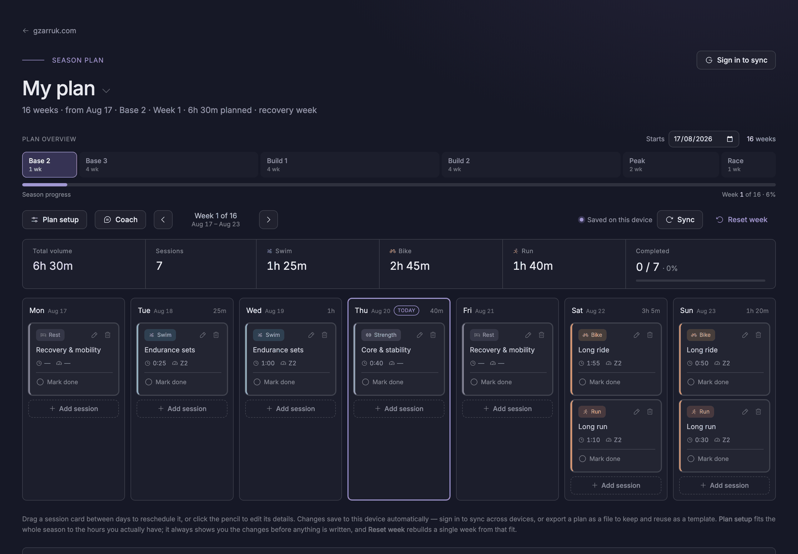

# yootri

<!-- SPDX-License-Identifier: MIT -->

A triathlon training planner that fits a season to the hours you actually have,
and keeps it in your own browser. It is free, open source, and has no server of
its own — no account is required, and nothing is uploaded unless you ask it to be.

Live at **https://yootri.gzarruk.com**



## What it does

- **Fits a season to a race date.** Give it a race and a rough annual hour
  budget and it lays out periodised blocks — base, build, peak, taper — landing
  on the day you race.
- **Turns hours into actual sessions.** A deterministic engine decides session
  lengths, disciplines and zones from the week's budget. It never invents time:
  if the week does not fit, it says so rather than quietly padding.
- **Works around your life.** Availability per day, standing constraints ("the
  pool is shut on Mondays", "no more than three swims a week") and per-block
  discipline splits all feed the fit.
- **Drag-and-drop rescheduling**, add/edit/delete sessions, mark sessions done.
- **Logs what actually happened** — duration, RPE, a note — separately from what
  was planned, and reports compliance against the plan.
- **Charts the season's training load**, weekly or cumulative, per discipline.
  Hand-drawn SVG; no charting library.
- **Multiple named plans**: create, switch, rename, duplicate, delete, export,
  import.

Nothing is edited in place. Any change — yours or the coach's — is built as a
draft, checked, shown to you as a diff, and only written when you apply it.

## The AI coach

The coach is optional and stays off until you configure it. It can read your
plan and propose changes; it cannot write to one. Everything it does lands in
the same draft-and-review gate as everything else, so the worst it can produce
is a proposal you reject.

- **Bring your own API key.** yootri has no server and no API account of its own.
- **Your key stays in your browser.** It is held in `localStorage`, is never
  written into a plan, and is never exported or synced. Anything that can run
  script on the page could read it, so use a key you are willing to rotate.
- **You pay your provider directly.** Conversations are billed to your own
  account. The model list is ordered cheapest first, and the default is the
  cheapest model that can reliably drive the tool loop.
- **I never see your data or your key.** Requests go from your browser straight
  to the provider you picked.
- **Coach conversations never leave your browser.** They are not synced and are
  not included in an exported plan.

Two providers are supported: **Anthropic**, and anything speaking the **OpenAI
Chat Completions** shape — OpenAI itself, OpenRouter, Groq, Together, LM Studio
or Ollama — through an editable base URL. A local endpoint works well here and
keeps everything on your own machine.

Responses are generated by an AI model, not a human coach, and can be wrong.

## Your data

- **Local first.** Everything saves to the browser's `localStorage` and works
  fully offline and signed out. This is a normal way to run yootri, not a
  degraded one.
- **Optional cloud sync.** Sign in with Google to sync plans across devices via
  Cloud Firestore. Last-write-wins by `updatedAt`. Plans are readable only by
  the account that wrote them — see [`firestore.rules`](firestore.rules).
- **Never synced:** your API key, and your coach conversations.
- **Export / import.** Any plan can be saved to a JSON file and loaded back,
  which is also how to move a plan between browsers without signing in.

## Run it locally

Assets use relative paths and ES modules need a real origin, so serve the folder
rather than opening `index.html` from disk:

```bash
python3 -m http.server 8000   # then open http://localhost:8000/
```

There is no build step and there are no dependencies. `package.json` exists only
so `node --test` can run the engine's unit tests:

```bash
npm test
```

## Forking and self-hosting

The app is static — any web server or static host will do, and GitHub Pages
serves it straight from the repo root.

One thing will bite you: **cloud sync will not work on your own domain** until
you point it at your own Firebase project and add your domain to that project's
authorized list. Until then the app runs local-only and says so in the UI, with
an explanation of what still works. That is a supported way to use it — if you
do not want sync, leave it exactly like that and everything except cross-device
syncing and Google sign-in works normally.

To set sync up, see [`FIREBASE_SETUP.md`](FIREBASE_SETUP.md).

To deploy on GitHub Pages: Settings → **Pages** → Source = **Deploy from a
branch**, Branch = `main`, Folder = **/ (root)**. To serve from your own
subdomain, replace the `CNAME` file with your domain, add a `CNAME` record at
your DNS host pointing to `<your-user>.github.io`, and tick **Enforce HTTPS**
once DNS has propagated.

## Layout

| Path | What it is |
| --- | --- |
| `index.html` | Markup, styles, DOM, storage and cloud sync |
| `assets/coach/*.js` | The engine: pure ES modules, no DOM and no I/O |
| `assets/nocturne.css` | The "Nocturne" design-system base |
| `tests/` | `npm test`, plain `node --test`, no framework |
| `firestore.rules` | Firestore security rules (owner-only, default deny) |

[`CLAUDE.md`](CLAUDE.md) is the contributor and architecture document. Read it
before changing the engine.

## Disclaimer

yootri is a training planner. It is **not medical advice**, and the developer is
not a certified coach, personal trainer, or medical professional. Consult a
physician before beginning any training programme. Endurance training carries
inherent and significant risks of injury, illness and death, and you are solely
responsible for your own training decisions.

The full text is in the app, under **About & disclaimer** in the footer.

## Support the project

yootri is free and MIT-licensed, and always will be. There is no paid tier, no
licence key, and nothing to unlock.

If it is useful to you and you would like to support its development, there is a
[supporter page on Gumroad](https://gzarruk.gumroad.com/l/yootri). That is a
contribution to the work, not a purchase of the software.

## License

MIT — see [`LICENSE`](LICENSE).

`SPDX-License-Identifier: MIT`
